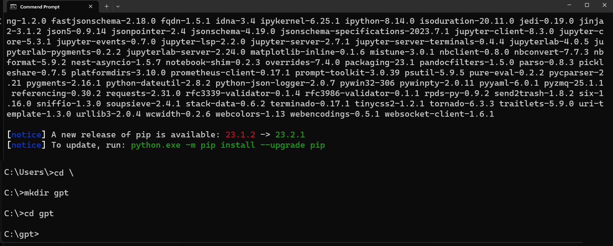
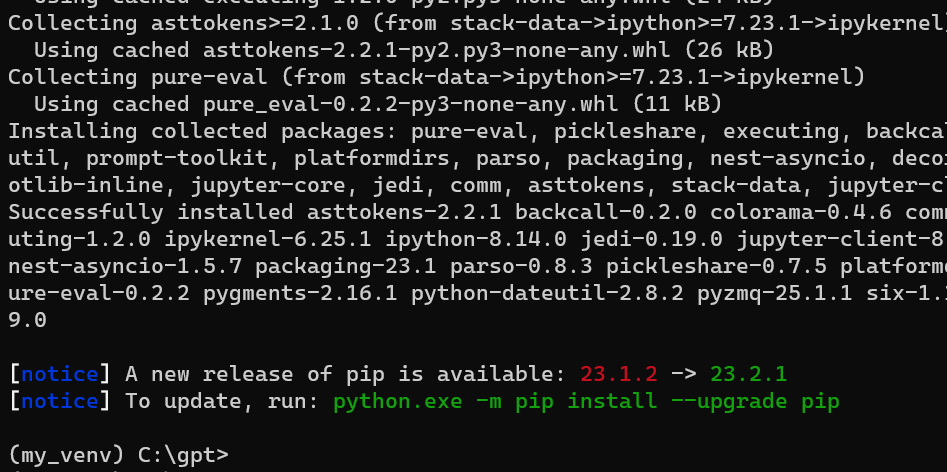
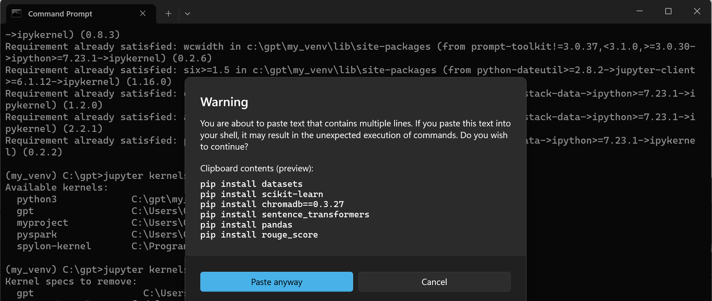

# Part 1 - Environment creation

[back](../README.md)

## Step 1: Install and Run Jupyter Lab locally

First we need to install python in our computer , in this demo I  will use Python **3.10.11**

[https://www.python.org/ftp/python/3.10.11/python-3.10.11-amd64.exe](https://www.python.org/ftp/python/3.10.11/python-3.10.11-amd64.exe)

During the installation I should suggest add **python.exe to PATH** and **install Now**


With Python already installed, you should have pip already installed. Be sure to use a pip that corresponds with Python 3 by using pip3 or checking your pip executable with "pip --version".

## Step 2: Create a Python virtual environment

A Python virtual environment allows one to use different versions of Python as well as isolate dependencies between projects. If you've never had several repos on your machine at once, you may never have felt this need but it's a good, Pythonic choice nonetheless. Future you will thank us both!

 Let us create a folder called gpt  and there we will  store our  virtual environment. 

```
mkdir gpt
cd gpt
```



Supposed that you have a different version of Python installed in your system. To check use the following command to check:

```
py --list
```


And you want to create a new virtual environment for python 3.10 on a 'test_env' directory. Run the following command:

```py
 py -3.10 -m venv my_venv
```

You'll notice a new directory in your current working directory with the same name as your virtual environment.

Activate the virtual environment.

Windows: 

```
cd C:\gpt
my_venv\Scripts\activate.bat
```


All other OSs: source 

```
./my_venv/bin/activate
```

When the virtual environment is activated, your command prompt should change in some way, indicating the name of the virtual environment. This is how you'll know it's active. You can further verify this by executing "which pip" or "which python" to see that both binaries are located inside you virtual environment directory.

A virtual environment is only activate in your current terminal session. There is no need to deactivate it before closing your terminal.

However, if you need to deactivate it you can do so by executing "deactivate", a script that only exists when a virtual environment is activated.

Note: Be sure to deactivate a virtual environment before deleting its directory.

### Step 3: Create a Jupyter Kernel from Inside your Virtual Environment

 We are goigng to install **Jupyter Lab.**

Let us open our command prompt and type

```
python.exe -m pip install --upgrade pip
```

```
pip install jupyterlab
```

For more information visit the official [Jupyter Lab](https://jupyterlab.readthedocs.io/en/stable/getting_started/installation.html#pip) site.

A Jupyter "kernel" is simply a reference to a particular Python interpreter instance. You can create a kernel from any Python interpreter on your machine, including those inside of virtual environments and then choose it as your kernel for any notebook. In this way, you can customize the environments of different notebooks benefiting from the same isolation virtual environments offer during normal development.

Once we are in our environment we proceed to install ipykernel

```
pip install ipykernel
```



then

```
python -m ipykernel install --user --name gpt --display-name "Python3 (GPT)"
```


With your virtual environment created and the ability to run a Jupyter Notebook in that environment.


## Install and import the dependecies


You can copy the following code block and paste it on your terminal where you are in your enviroment.

```
pip install datasets 
pip install scikit-learn 
pip install chromadb==0.3.27 
pip install sentence_transformers
pip install pandas 
pip install rouge_score 
pip install nltk 
pip install "ibm-watson-machine-learning>=1.0.312" 
pip install ipywidgets widgetsnbextension pandas-profiling
pip install mlxtend

```



If we are in Linux we can add the followig condition after each line `| tail -n 1` to surpress logs. 

Before run the notebook, we require load our IBM cloud services.


# Step 5 - Login to IBM cloud


after you have logged, create a WatsonX instance

[https://www.ibm.com/watsonx](https://www.ibm.com/watsonx)


Then open a simple Prompt Lab


Then click  **View Code** and then  click  on  **Create personal API key**


then we create our custom GPT API, I call it gpt and I give an small description


I copy the API key for future use


## Creation of shortcuts
Once we have created our enviroments we need to load it during the the Stages:
2-Data creation
3-Modeling 

For windows let us create .bat file called env.bat
```
C:\gpt\my_venv\Scripts\activate

```
then to load you simply type
```

enb.bat
```


For unix systems create .sh file called env.sh
```
gpt/my_venv/bin/activate
```
you type
```
sh  env.sh
```

then type
```
jupyter lab

```


Now we are ready to start working. Let us go to the Next step [2-Data.](../2-Data/README.md)

